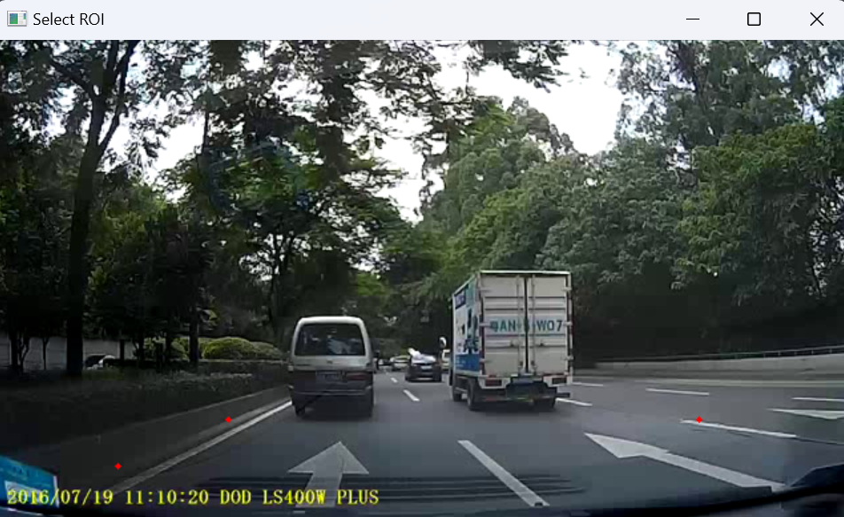
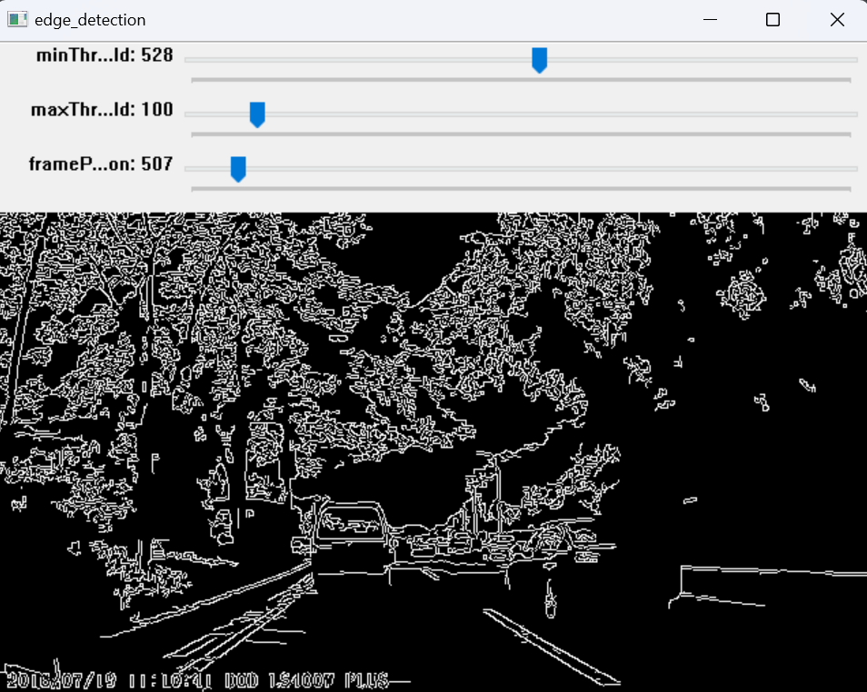

# lane_detect
This is a lane detection program developed using OpenCV. It uses techniques such as Canny Edge Detection, Hough Transform, and RANSAC for line fitting. The program allows users to select the Region of Interest (ROI) before running.  
  
  
  

## Technologies Used

Canny Edge Detection: A multi-stage algorithm to detect a wide range of edges in images. It was developed by John F. Canny in 1986.  

Hough Transform: A feature extraction technique used in image analysis, computer vision, and digital image processing. It is used to detect simple shapes such as lines and circles.  

RANSAC (Random Sample Consensus): An iterative method to estimate parameters of a mathematical model from a set of observed data that contains outliers.  

## How to Run
The dependencies for this program are listed in the requirements.txt file. You can install them using pip:
```bash
pip install -r requirements.txt
```

To run the program, use the following command:
```bash
python lane_detect.py {$video_path}
```
Replace {$video_path} with the path to your video file.

## Note
This program is designed to work with video files. The user is required to select the ROI before the program starts processing the video for lane detection.  
``canny.py` Visual Canny Edge Detection works. command: `python canny.py {$path_to_your_video}`


## Relate blog
<https://blog.csdn.net/lijj0304/article/details/131645032>